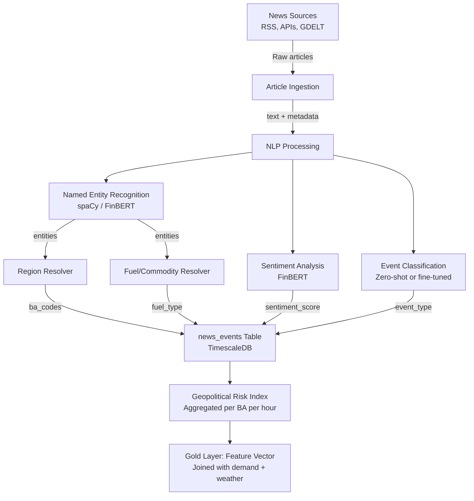

# SENTINEL — NLP Integration Architecture
## How NLP Connects to the DB, Matches Regions & Time, and Which Services to Use

---

## 1. The Core Problem: Linking News Articles to BA-Level Energy Data

A news article like *"Nat gas pipeline explosion in West Texas"* has **no BA code, no MWh value, no timestamp in EIA format**. The NLP pipeline must bridge the gap between **unstructured text** and your **structured TimescaleDB tables**.

```
NEWS ARTICLE                          DATABASE
─────────────                         ─────────────
"pipeline explosion"      →           event_type: SUPPLY_DISRUPTION
"West Texas"              →           ba_codes: [ERCO]
"natural gas"             →           fuel_type: NG
"published 2025-03-15"    →           event_time: 2025-03-15T00:00Z
sentiment: -0.85          →           risk_score: HIGH
```

---

## 2. NLP Pipeline Architecture — Step by Step



---

## 3. How Regions Match to the Database

### The Mapping Problem

EIA data uses **Balancing Authority codes** (e.g., `ERCO`, `CISO`, `PJM`). News articles mention **geographic names** (e.g., "Texas", "Gulf Coast", "Appalachia").

### Solution: A Static Lookup Table + NLP Entity Resolution

#### Step 1: Build a `ba_region_mapping` reference table

```sql
CREATE TABLE ba_region_mapping (
    ba_code       TEXT NOT NULL,        -- e.g., 'ERCO'
    ba_name       TEXT NOT NULL,        -- e.g., 'Electric Reliability Council of Texas'
    state_codes   TEXT[] NOT NULL,      -- e.g., '{TX}'
    region_names  TEXT[] NOT NULL,      -- e.g., '{Texas, West Texas, Gulf Coast, ERCOT}'
    fuel_profile  JSONB,               -- e.g., '{"NG": 0.48, "WND": 0.25, ...}'
    PRIMARY KEY (ba_code)
);

-- GIN index for fast array-contains lookups (O(1) vs O(n) scan)
CREATE INDEX idx_region_names_gin ON ba_region_mapping USING GIN (region_names);

-- JSONB index for fuel-dependency threshold queries
CREATE INDEX idx_fuel_profile ON ba_region_mapping USING GIN (fuel_profile jsonb_path_ops);
```

This table maps **every keyword a news article might use** to its corresponding BA code(s). Examples:

| Keyword in Article | Matched BA Code(s) | Why |
|---|---|---|
| "Texas", "ERCOT", "West Texas" | `ERCO` | Direct geographic match |
| "California", "CAISO" | `CISO` | Direct match |
| "PJM", "Mid-Atlantic", "Pennsylvania" | `PJM` | PJM spans 13 states |
| "Gulf Coast" | `ERCO`, `MISO`, `SWPP` | Ambiguous — maps to multiple BAs |
| "Strait of Hormuz", "OPEC" | *ALL gas-dependent BAs* | Global event → filter by fuel dependency |

#### Step 2: NLP Entity Extraction → Region Resolution

```python
from functools import lru_cache

# Pre-load the entire mapping into memory at startup (65 BAs = trivial)
# Builds a trie-like dict for O(1) lookups instead of DB round-trips
class RegionResolver:
    def __init__(self, db):
        rows = db.query("SELECT ba_code, region_names, fuel_profile FROM ba_region_mapping")
        # Inverted index: region_name → set of BA codes
        self._region_to_bas: dict[str, set[str]] = {}
        self._fuel_profiles: dict[str, dict] = {}
        for row in rows:
            self._fuel_profiles[row.ba_code] = row.fuel_profile
            for name in row.region_names:
                self._region_to_bas.setdefault(name.lower(), set()).add(row.ba_code)
        self._all_names = list(self._region_to_bas.keys())
    
    def resolve(self, entities: list[str], is_commodity: bool = False, fuel: str = None) -> list[str]:
        matched = set()
        for entity in entities:
            key = entity.lower()
            # 1. O(1) direct lookup from in-memory inverted index
            if key in self._region_to_bas:
                matched.update(self._region_to_bas[key])
            else:
                # 2. Fuzzy match (only on cache miss)
                from rapidfuzz import fuzz
                for name in self._all_names:
                    if fuzz.ratio(key, name) > 85:
                        matched.update(self._region_to_bas[name])
                        break
        
        # 3. Global events → fuel-dependency threshold
        if not matched and is_commodity and fuel:
            matched = {
                ba for ba, profile in self._fuel_profiles.items()
                if profile.get(fuel, 0) > 0.30
            }
        return list(matched)
```

> [!TIP]
> **Why in-memory?** With only 65 BAs, the entire mapping fits in <1 KB. Eliminating DB round-trips per article drops region resolution from ~2ms to ~0.01ms — a **200× speedup** that matters when processing thousands of GDELT articles in batch.

> [!IMPORTANT]
> **Global events (oil/gas price shocks, OPEC decisions)** don't map to one BA — they map to **all BAs that depend on that fuel above a threshold** (e.g., >30% gas dependency). This is where your `fuel-type-data` (Table 2) becomes critical: it tells you which BAs are vulnerable.

---

## 4. How Time Matching Works

### The Timestamp Alignment Problem

| Source | Time Format | Granularity |
|---|---|---|
| EIA demand data | `2025-03-15T14` (UTC) | Hourly |
| News article published | `2025-03-15T10:32:00-05:00` | Arbitrary |
| GDELT event | `20250315` | Daily |
| Gas price (Henry Hub) | `2025-03-15` | Daily |

### Solution: Normalize Everything to Hourly UTC Bins

```sql
-- news_events table in TimescaleDB (Silver layer)
CREATE TABLE news_events (
    event_id          SERIAL,
    event_time        TIMESTAMPTZ NOT NULL,  -- normalized to hour: 2025-03-15T15:00Z
    published_time    TIMESTAMPTZ NOT NULL,  -- original article timestamp
    ba_codes          TEXT[],                -- resolved BA codes
    fuel_types        TEXT[],                -- mentioned fuels
    event_type        TEXT,                  -- SUPPLY_DISRUPTION / POLICY / DEMAND / PRICE
    sentiment_score   FLOAT,                -- -1.0 to +1.0
    risk_magnitude    FLOAT,                -- 0.0 to 1.0
    source            TEXT,                  -- 'reuters', 'eia_rss', 'gdelt'
    headline          TEXT,
    raw_text          TEXT,
    content_hash      TEXT NOT NULL,         -- SHA-256 of headline+source for dedup
    PRIMARY KEY (event_time, event_id)       -- composite PK for hypertable partitioning
);

-- Hypertable with 7-day chunks (optimized for 24h lookback queries)
SELECT create_hypertable('news_events', 'event_time', chunk_time_interval => INTERVAL '7 days');

-- Prevent duplicate articles (same story from multiple feeds)
CREATE UNIQUE INDEX idx_dedup ON news_events (content_hash, event_time);

-- Fast lookups by BA code within time ranges
CREATE INDEX idx_ba_time ON news_events USING GIN (ba_codes) WITH (fastupdate = off);

-- Enable TimescaleDB compression after 30 days (saves ~90% storage)
ALTER TABLE news_events SET (
    timescaledb.compress,
    timescaledb.compress_segmentby = 'source',
    timescaledb.compress_orderby = 'event_time DESC'
);
SELECT add_compression_policy('news_events', INTERVAL '30 days');
```

#### Time Normalization Logic

```python
import hashlib
from datetime import datetime, timezone

def normalize_event_time(published_time: datetime) -> datetime:
    """Floor to the nearest hour in UTC."""
    utc_time = published_time.astimezone(timezone.utc)
    return utc_time.replace(minute=0, second=0, microsecond=0)

def content_hash(headline: str, source: str) -> str:
    """Generate dedup hash — prevents re-processing the same story from multiple feeds."""
    return hashlib.sha256(f"{headline.lower().strip()}|{source}".encode()).hexdigest()
```

#### Joining NLP Features with Demand Data

> [!WARNING]
> A naive `LATERAL JOIN` on every demand row × 24h of news events is **O(demand_rows × news_rows)** — extremely slow on 10M+ demand rows. Use a pre-computed rolling aggregate instead.

```sql
-- OPTIMIZED: Pre-compute rolling NLP features per BA per hour
-- This runs ONCE, not per-demand-row
CREATE MATERIALIZED VIEW nlp_features_hourly AS
SELECT
    hour_series.hour                           AS period,
    ba.ba_code,
    COALESCE(AVG(ne.sentiment_score), 0)       AS news_sentiment_24h,
    COALESCE(MAX(ne.risk_magnitude), 0)        AS news_max_risk_24h,
    COALESCE(COUNT(ne.*), 0)                   AS news_event_count_24h,
    COALESCE(BOOL_OR(ne.event_type = 'SUPPLY_DISRUPTION'), FALSE) AS supply_disruption_24h
FROM 
    generate_series(
        '2021-01-01'::timestamptz,
        NOW(),
        '1 hour'::interval
    ) AS hour_series(hour)
    CROSS JOIN (SELECT DISTINCT ba_code FROM ba_region_mapping) ba
    LEFT JOIN news_events ne 
        ON ba.ba_code = ANY(ne.ba_codes)
       AND ne.event_time BETWEEN hour_series.hour - INTERVAL '24 hours' AND hour_series.hour
GROUP BY 1, 2;

CREATE UNIQUE INDEX idx_nlp_features_pk ON nlp_features_hourly (period, ba_code);

-- Gold layer: simple equi-join (fast, index-backed)
CREATE MATERIALIZED VIEW demand_with_nlp AS
SELECT 
    d.period, d.ba_code, d.demand_mwh, d.forecast_mwh,
    n.news_sentiment_24h,
    n.news_max_risk_24h,
    n.news_event_count_24h,
    n.supply_disruption_24h
FROM demand_clean d
LEFT JOIN nlp_features_hourly n 
    ON d.period = n.period AND d.ba_code = n.ba_code;
```

> [!TIP]
> The **24-hour lookback window** is key. A news article at 10 AM about a pipeline explosion doesn't instantly affect the 10 AM demand reading — but it signals risk for the **next 24 hours**. The model learns the lag relationship.

---

## 5. Geopolitical Risk Index — Aggregation for Feature Engineering

The raw `news_events` table feeds into an **aggregated risk index** per BA per hour:

```sql
-- Continuous aggregate for efficient ML feature reads
CREATE MATERIALIZED VIEW geopolitical_risk_index
WITH (timescaledb.continuous) AS
SELECT
    time_bucket('1 hour', event_time)       AS hour,
    unnest(ba_codes)                        AS ba_code,
    AVG(sentiment_score)                    AS avg_sentiment,
    MIN(sentiment_score)                    AS min_sentiment,
    MAX(risk_magnitude)                     AS max_risk,
    COUNT(*) FILTER (WHERE event_type = 'SUPPLY_DISRUPTION') AS disruption_count,
    COUNT(*) FILTER (WHERE event_type = 'POLICY')            AS policy_count,
    COUNT(*)                                AS total_events
FROM news_events
GROUP BY 1, 2;
```

This becomes a **feature vector** that your XGBoost/LSTM models consume alongside demand lags and weather:

| Feature Name | Source | Type |
|---|---|---|
| `news_sentiment_24h` | NLP pipeline | Float [-1, 1] |
| `news_max_risk_24h` | NLP pipeline | Float [0, 1] |
| `disruption_event_count_24h` | NLP pipeline | Integer |
| `supply_disruption_flag_24h` | NLP pipeline | Boolean |
| `geopolitical_risk_index` | Aggregated NLP | Float [0, 1] |

---

## 6. Service Recommendations — Best Options for SENTINEL

### Recommended Architecture: **Self-Hosted NLP + Free News APIs**

Given your constraints (local compute, RTX 4060, research project), here's what fits best:

### News Ingestion Services

| Service | Cost | Best For | Region Support | Rate Limits |
|---|---|---|---|---|
| **GDELT Project** ⭐ | **Free** | Global events with pre-scored tone, geo-tagged to countries/regions | ✅ Built-in geocoding | Unlimited |
| **NewsAPI.ai** ⭐ | **Free tier** (1K req/month) | Broad news with NLP enrichment (entities, categories, sentiment) | ✅ Location extraction included | 1K/month free |
| **EIA "Today in Energy" RSS** | **Free** | U.S.-specific energy policy/market commentary | ❌ No geocoding (manual) | Unlimited |
| **MediaStack** | **Free tier** (500 req/month) | General headlines, keyword search | ❌ No NLP | 500/month free |
| **Event Registry** | **Free tier** (2K events/month) | Events with entities, concepts, categories | ✅ Advanced entity extraction | 2K/month free |

> [!IMPORTANT]
> **Top recommendation: Use GDELT + NewsAPI.ai together.**
> - **GDELT** gives you a massive free firehose of geo-tagged, tone-scored events — perfect for training and backtesting
> - **NewsAPI.ai** gives you real-time article retrieval with built-in NLP (entities, categories, sentiment) — saving you from running extraction yourself on every article

### NLP Model Services (for Sentiment & Entity Extraction)

| Option | Where It Runs | Cost | Latency | Quality |
|---|---|---|---|---|
| **FinBERT (local)** ⭐ | Your RTX 4060 | **Free** | ~50ms/article | Best for financial/energy text |
| **DistilBERT (local)** | Your RTX 4060 | **Free** | ~30ms/article | Good general-purpose |
| **spaCy NER (local)** ⭐ | CPU | **Free** | ~5ms/article | Best for entity extraction |
| Google Cloud NLP API | Cloud | $1/1K docs | ~200ms/article | Good, but unnecessary |
| OpenAI API | Cloud | $0.50/1M tokens | ~500ms/article | Overkill for this task |

> [!TIP]
> **Top recommendation: Run everything locally.**
> - **spaCy** for Named Entity Recognition (locations, orgs, commodities) — fast, free, CPU-only
> - **FinBERT** for sentiment analysis — specifically trained on financial text, runs on your GPU
> - **Zero-shot classification** (Hugging Face) for event type categorization — no fine-tuning needed initially
>
> This avoids API costs, rate limits, and works offline. Fine-tune FinBERT on energy-specific text later (Phase 4, Week 11).

### Why NOT Use Cloud NLP APIs?

| Concern | Why It Matters |
|---|---|
| **Cost at scale** | Processing thousands of articles/day adds up |
| **Rate limits** | Free tiers are too restrictive for backtesting on 2 years of GDELT data |
| **Latency** | Local GPU inference is 5-10× faster than API calls |
| **Reproducibility** | Local models give identical results on re-run; APIs may change |
| **Your GPU handles it** | RTX 4060 can run FinBERT at ~50ms/article = ~72K articles/hour |

---

## 7. End-to-End Data Flow Summary

```
1. INGEST: GDELT + NewsAPI.ai → raw_news (Bronze)
   ↓
2. DEDUP: content_hash check → skip already-processed articles
   ↓
3. NLP PROCESS (local, batched):
   - spaCy NER → extract locations, orgs, commodities  (CPU, batch=128)
   - FinBERT → sentiment score                         (GPU, batch=32)
   - Zero-shot classifier → event type                 (GPU, batch=16)
   ↓
4. RESOLVE (in-memory):
   - Location entities → RegionResolver cache → BA codes
   - Commodity entities → fuel types
   - Timestamp → floor to hourly UTC
   ↓
5. STORE: news_events table (Silver) in TimescaleDB
   ↓
6. AGGREGATE: geopolitical_risk_index (continuous aggregate)
   ↓
7. JOIN: nlp_features_hourly → demand_with_nlp (Gold) — simple equi-join
   ↓
8. PREDICT: XGBoost/LSTM consume the Gold layer features
```

---

## 8. Performance Optimizations

### NLP Inference: Batched GPU Processing

```python
from transformers import pipeline
import torch

# Batched inference: ~4× throughput vs one-at-a-time
sentiment_pipe = pipeline(
    "text-classification",
    model="ProsusAI/finbert",
    device=0,                    # RTX 4060
    torch_dtype=torch.float16,   # Half precision: 2× memory savings
    batch_size=32                # Sweet spot for 8GB VRAM
)

# Process articles in chunks
def process_batch(articles: list[dict]) -> list[dict]:
    texts = [a["headline"] + " " + a["summary"] for a in articles]
    
    # GPU: sentiment (batched)
    sentiments = sentiment_pipe(texts, truncation=True, max_length=512)
    
    # CPU: NER (batched via spaCy pipe)
    docs = nlp.pipe(texts, batch_size=128, n_process=2)
    
    results = []
    for article, sent, doc in zip(articles, sentiments, docs):
        entities = [(ent.text, ent.label_) for ent in doc.ents]
        results.append({
            "sentiment": sent["score"] * (1 if sent["label"] == "positive" else -1),
            "entities": entities,
            "ba_codes": resolver.resolve([e[0] for e in entities if e[1] in ("GPE", "LOC")]),
        })
    return results
```

### Throughput on Your Hardware

| Component | Per Article | Batched (32) | Articles/Hour |
|---|---|---|---|
| spaCy NER (CPU) | ~5ms | ~2ms effective | ~1.8M |
| FinBERT FP16 (GPU) | ~50ms | ~12ms effective | ~300K |
| Region resolver (memory) | ~0.01ms | ~0.01ms | ∞ |
| **Total pipeline** | **~55ms** | **~14ms** | **~257K** |

### Memory Management (16GB RAM Constraint)

- **GDELT backfill**: Process in daily batches (~2K–5K articles/day), don't load full 2-year corpus
- **spaCy model**: Use `en_core_web_sm` (12MB) not `en_core_web_trf` (500MB) for NER
- **FinBERT**: FP16 mode uses ~400MB VRAM (vs 800MB FP32) — leaves room for other GPU work
- **DB writes**: Batch `INSERT` in chunks of 500 rows via `psycopg2.extras.execute_values()`

### Deduplication Strategy

```python
from pybloom_live import ScalableBloomFilter

# In-memory bloom filter for fast dedup before DB check
bloom = ScalableBloomFilter(initial_capacity=100_000, error_rate=0.001)

def is_duplicate(headline: str, source: str) -> bool:
    h = content_hash(headline, source)
    if h in bloom:
        return True   # Probably seen (0.1% false positive rate)
    bloom.add(h)
    return False
```

---

## 9. Key Design Decisions Summary

| Decision | Choice | Rationale |
|---|---|---|
| NLP runs locally | FinBERT FP16 + spaCy on RTX 4060 | Free, fast, reproducible, no rate limits |
| News source | GDELT (bulk/backtest) + NewsAPI.ai (real-time) | Best free coverage with built-in geo-tagging |
| Region resolution | In-memory inverted index + fuzzy fallback | 200× faster than DB lookups, fits in <1 KB |
| Time alignment | Floor to hourly UTC, 24h lookback window | Matches EIA's hourly granularity |
| Feature aggregation | Pre-computed `nlp_features_hourly` + equi-join | Avoids expensive LATERAL joins on 10M+ rows |
| Dedup | Content hash + bloom filter | Prevents re-processing duplicate articles |
| Batching | GPU batch=32, CPU batch=128 | ~4× throughput vs sequential processing |
| Compression | TimescaleDB auto-compress after 30 days | ~90% storage reduction for old news data |
