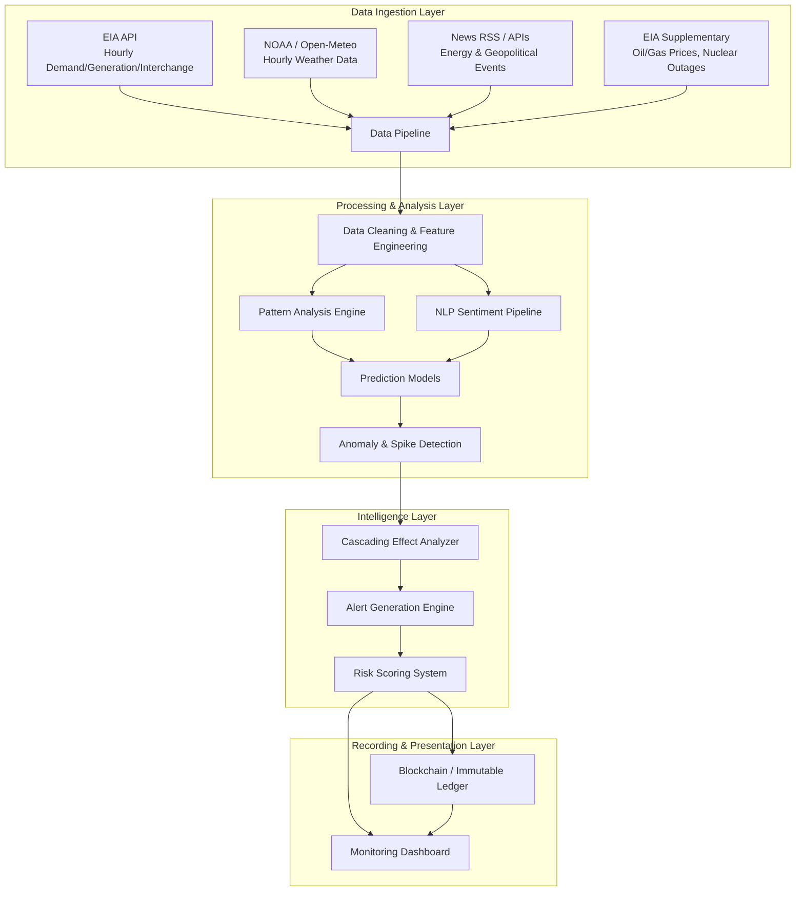
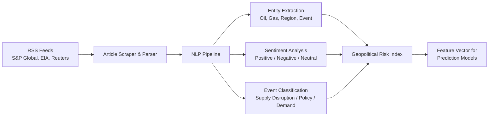
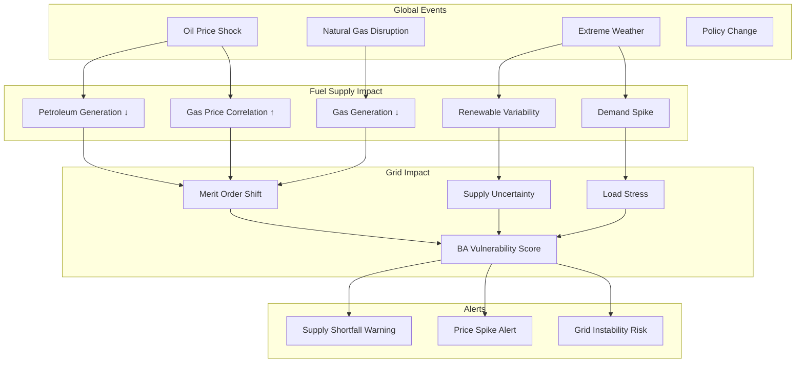

# Predictive Energy Monitoring Framework — Project Architecture & Implementation Plan

## Overview

A national-level, scalable predictive monitoring framework for U.S. energy supply systems using EIA Open Data, weather data, and news/geopolitical signals. The system predicts demand spikes 24 hours ahead, analyzes cascading supply disruptions, and records events on an immutable ledger.

---

## System Architecture



---

## Module Breakdown

### Module 1: Data Ingestion & Storage

#### Data Sources & Recommended History

| Source | Data | History to Pull | Rationale |
|---|---|---|---|
| **EIA API** | Hourly demand, forecast, generation, interchange | **5 years** (2021–2026) | Captures post-COVID patterns, enough for seasonal learning, manageable volume (~20M rows) |
| **EIA API** | Hourly generation by energy source | **5 years** (2021–2026) | Fuel-mix analysis, renewable variability |
| **EIA API** | Nuclear plant outages (daily) | **5 years** | Supply disruption signals |
| **EIA API** | Natural gas & oil spot prices | **5 years** (monthly/daily) | Generation cost proxy, cascading effect trigger |
| **NOAA / Open-Meteo** | Hourly temperature, humidity, wind | **5 years**, matched to BA regions | Primary demand driver |
| **News APIs** | Energy news sentiment | **1–2 years** (or real-time only) | Geopolitical event signals |

> [!TIP]
> **Why 5 years?** This gives you ~5 full seasonal cycles (capturing summer/winter peaks), includes the 2021 Texas grid crisis and 2022 energy price shock — both excellent test cases for your spike prediction model. Going beyond 5 years adds diminishing returns relative to storage/processing cost and risks including outdated grid behavior patterns.

#### Storage Design

- **Time-series database** (TimescaleDB or InfluxDB) for hourly operational data
- **PostgreSQL** for metadata, alerts, and event history
- **Object storage** (S3/MinIO) for raw API responses and model artifacts

---

### Module 2: Pattern Analysis Engine

**Goal:** Identify regular patterns and deviations in energy consumption.

| Analysis Type | Method | Output |
|---|---|---|
| Trend extraction | STL decomposition (seasonal-trend) | Trend, seasonal, and residual components |
| Daily load profiling | K-means clustering on 24h profiles | Cluster labels per day (e.g., "high-summer-weekday") |
| Seasonal patterns | Fourier features + calendar encoding | Seasonal coefficients |
| Anomaly detection | Isolation Forest on residuals | Anomaly scores per hour |
| Change point detection | PELT / Bayesian Online CPD | Structural change timestamps |

---

### Module 3: NLP & Geopolitical Intelligence Pipeline

**This is your novel research contribution — and a strong one.**

#### Architecture



#### Cascading Effect Analysis — Your Oil Example Formalized

This is the deep innovation area. The idea is to model **supply chain propagation**:

```
Global Event (Strait of Hormuz closure)
    → Oil price spike (+46% in 10 days)
        → Natural gas price correlation (substitution effect)
            → Gas-fired generation cost increase
                → Shift in generation merit order
                    → Potential supply shortfall in gas-dependent BAs
                        → Demand-supply gap → Grid stress alert
```

**Implementation approach:**
1. **Dependency graph** of energy sources — which BAs depend heavily on what fuel?
2. **Price sensitivity model** — how does a $/barrel change in oil translate to generation cost?
3. **News-triggered simulations** — when NLP detects "Strait of Hormuz" + negative sentiment, run what-if scenarios on the dependency graph
4. **Cascading risk score** — propagate risk through the graph to generate BA-level vulnerability ratings

**Recommended data sources for news:**

| Source | Type | Cost | Best For |
|---|---|---|---|
| EIA "Today in Energy" RSS | RSS feed | Free | U.S. policy and market commentary |
| S&P Global Energy RSS | RSS feed | Free (headlines) | Commodity price signals |
| NewsAPI.ai | REST API | Free tier available | Broad geopolitical event detection |
| Energy Debrief API | REST API | Paid (has free trial) | Pre-scored energy news |
| GDELT Project | Open dataset | Free | Global event database with tone scores |

---

### Module 4: Prediction Models (24h Horizon)

#### Model Architecture

| Model | Role | Input Features |
|---|---|---|
| **XGBoost** | Primary demand spike classifier | Temporal features, weather, lag values, day-of-week, holidays |
| **LSTM (Bidirectional)** | Sequence-based demand forecasting | 168h (7-day) sliding window of hourly demand |
| **CNN-LSTM Hybrid** | Combined spatial-temporal patterns | Multi-BA demand + weather grids |
| **Prophet** | Baseline seasonal forecast | Demand time series (comparison benchmark) |

#### Feature Engineering

| Feature Category | Features | Source |
|---|---|---|
| Temporal | hour, day_of_week, month, is_holiday, is_weekend | Calendar |
| Weather | temperature, humidity, wind_speed, heating_degree_days, cooling_degree_days | NOAA |
| Lag features | demand_t-1, demand_t-24, demand_t-168, demand_7d_rolling_avg | EIA history |
| Supply | generation_by_fuel, nuclear_outage_flag, interchange_net | EIA |
| Economic | gas_spot_price, oil_spot_price, electricity_retail_price | EIA |
| Geopolitical | news_sentiment_score, geopolitical_risk_index, supply_disruption_flag | NLP pipeline |

#### Prediction Outputs

- **Point forecast:** Expected demand (MWh) for each of the next 24 hours
- **Spike probability:** P(demand > P95 threshold) for each hour
- **Confidence interval:** 80% and 95% prediction intervals
- **Risk classification:** LOW / MEDIUM / HIGH / CRITICAL

---

### Module 5: Blockchain — Where It Actually Adds Value

> [!IMPORTANT]
> **Honest assessment:** Using blockchain purely for event logging is valid but **undersells its potential** in this project. Here's a better way to use it.

#### ❌ Blockchain for Event Recording Only (Weak Use)
- Immutable logging of alerts and events
- Could be replaced by a signed append-only database
- Adds complexity without leveraging blockchain's core strengths (decentralization, smart contracts)

#### ✅ Blockchain for Prediction Accountability & Trust (Strong Use)

| Use Case | Value | Implementation |
|---|---|---|
| **Prediction audit trail** | Hash each prediction + timestamp on-chain *before* the actual demand is known. This proves predictions weren't retroactively altered. | Smart contract stores: `hash(prediction, timestamp, model_version)` |
| **Model performance verification** | Anyone can verify that reported model accuracy matches actual on-chain predictions vs. later-observed actuals | Comparison contract that scores predictions against actuals |
| **Alert integrity** | Grid operators can verify that alerts were issued at claimed times | Event emission on alert generation |
| **Multi-stakeholder transparency** | If multiple BAs or operators use the system, they can independently verify predictions without trusting a central authority | Permissioned blockchain (Hyperledger or Polygon PoS) |

#### Recommended Blockchain Stack

| Component | Technology | Why |
|---|---|---|
| Chain | **Polygon PoS** or **Hyperledger Fabric** | Low gas cost (Polygon) or private/permissioned (Hyperledger) |
| Smart contracts | **Solidity** (Polygon) or **Chaincode** (Hyperledger) | Industry standard |
| On-chain data | Prediction hashes, timestamps, model IDs | Minimal storage cost |
| Off-chain data | Full predictions, model weights, raw data | Stored in traditional DB, referenced by on-chain hash |

**This approach transforms blockchain from a simple logger into a verifiable prediction accountability system** — a much stronger research contribution.

---

### Module 6: Cascading Effects Analysis — Deep Dive

This is your most novel idea. Here's how to formalize it:

#### Energy Source Dependency Analysis



#### Per-BA Fuel Dependency Profile

Using the **Hourly Generation by Energy Source** data, you can build a fuel dependency profile for each BA:

```
BA: "ERCOT" (Texas)
├── Natural Gas: 48% of generation
├── Wind: 25%
├── Solar: 8%
├── Nuclear: 10%
├── Coal: 9%
└── Vulnerability: HIGH to gas price shocks, MEDIUM to wind variability
```

When the NLP pipeline detects a gas supply disruption event, the cascading effect analyzer:
1. Identifies all BAs with >30% gas dependency
2. Estimates generation shortfall based on the disruption magnitude
3. Checks if interchange capacity from neighboring BAs can compensate
4. Outputs a risk score and time-to-impact estimate

---

## Proposed Tech Stack

| Layer | Technology |
|---|---|
| Language | Python 3.11+ |
| ML Framework | PyTorch (LSTM/CNN), scikit-learn (XGBoost, Isolation Forest), Prophet |
| NLP | Hugging Face Transformers (FinBERT or DistilBERT fine-tuned on energy text) |
| Data Pipeline | Apache Airflow or Prefect (for scheduled ingestion) |
| Time-series DB | TimescaleDB (PostgreSQL extension) |
| Blockchain | Polygon PoS + Solidity (or Hyperledger Fabric for private chain) |
| Dashboard | Streamlit or Plotly Dash (research prototype), React + D3.js (production) |
| API Layer | FastAPI |
| Containerization | Docker + Docker Compose |

---

## Project Phases

### Phase 1: Data Foundation (Weeks 1–3)
- [ ] Set up project structure and dependencies
- [ ] Build EIA API data ingestion pipeline (5 years of hourly data)
- [ ] Build weather data ingestion (NOAA/Open-Meteo)
- [ ] Design and create database schema
- [ ] Data cleaning and validation pipeline

### Phase 2: Pattern Analysis & Baseline Models (Weeks 4–6)
- [ ] STL decomposition and seasonal analysis
- [ ] Load profile clustering
- [ ] Anomaly detection (Isolation Forest)
- [ ] Prophet baseline forecasting
- [ ] EIA forecast comparison benchmark

### Phase 3: Advanced Prediction Models (Weeks 7–9)
- [ ] Feature engineering pipeline
- [ ] XGBoost spike classifier
- [ ] LSTM demand forecaster
- [ ] CNN-LSTM hybrid model
- [ ] Model evaluation and comparison

### Phase 4: NLP & Cascading Effects (Weeks 10–12)
- [ ] News RSS/API ingestion pipeline
- [ ] NLP sentiment analysis pipeline
- [ ] Geopolitical risk index construction
- [ ] Energy source dependency graph
- [ ] Cascading effect simulation engine

### Phase 5: Blockchain & Event Recording (Weeks 13–14)
- [ ] Smart contract for prediction hashing
- [ ] Prediction accountability system
- [ ] Alert integrity verification
- [ ] Integration with prediction pipeline

### Phase 6: Dashboard & Integration (Weeks 15–16)
- [ ] Monitoring dashboard
- [ ] Alert visualization
- [ ] Real-time prediction display
- [ ] End-to-end system integration testing

---

## Verification Plan

### Automated Tests
- **Unit tests** for each data ingestion module (EIA, weather, news)
- **Integration tests** for the full pipeline (ingest → predict → alert → record)
- **Model evaluation metrics:** MAPE, RMSE, F1-score for spike detection, precision/recall curves
- **Backtesting:** Run predictions on historical data (e.g., 2021 Texas crisis) and verify alerts would have fired

### Model Validation
- **Train/validation/test split:** 2021–2024 training, 2025 validation, 2026 test
- **Comparison baselines:** Beat EIA's own day-ahead forecast and naive persistence model
- **Ablation study:** Measure accuracy gain from each feature category (weather, news, etc.)

### Blockchain Verification
- **Smart contract unit tests** using Hardhat or Truffle
- **Verify prediction hashes** can be independently validated

### Manual Verification
- User reviews dashboard visualizations for correctness
- User validates alert logic against known historical events

---

## Key Research Questions This Architecture Addresses

| Question from Project Description | How This Architecture Answers It |
|---|---|
| Can demand spikes be identified before they occur? | 24h-ahead spike probability via XGBoost + LSTM |
| What patterns precede disruptions? | STL decomposition + clustering + anomaly detection |
| How can operators receive early warnings? | Alert generation engine + dashboard + risk scoring |
| How can events be recorded verifiably? | Blockchain prediction accountability system |
| **(NEW)** Can geopolitical events predict energy disruptions? | NLP pipeline + cascading effect analyzer |
| **(NEW)** How do fuel source dependencies propagate risk? | Energy source dependency graph + simulation |
